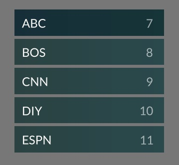

## Built on top of

New Blits Lightning 3 Get Started project
https://lightningjs.io/v3-docs/blits/getting_started/getting_started.html

## Fast scrolling column component for large data-set

NetworkColumn uses no animation or real "scrolling". Instead uses a fixed number of rows. As user presses up/down arrow key, the next/previous 5 of 1000 items are used to update the elements' text properties. Avoids lag caused by rendering and scrolling too many elements.

https://github.com/braddiver/my-blits-app/blob/main/src/components/NetworkColumn.js

## Used as a demo to compare development in Lightning 3 frameworks

### Solid-JS

https://lightning-js.github.io/solid/#/

### Blits

https://lightningjs.io/v3-docs/blits/components/component_state.html

## Solid-JS version of the same NetworkColumn component

https://github.com/braddiver/lightn3solidstart/blob/main/src/components/NetworkColumn.tsx

## Issues

Unlike the Solid-JS version I was unable to

- Use a loop utility component in the markup to generate the 5 rows:
  https://github.com/braddiver/my-blits-app/blob/3cff5ede832e291c680076836db01a9b04b93679/src/components/NetworkColumn.js#L25
